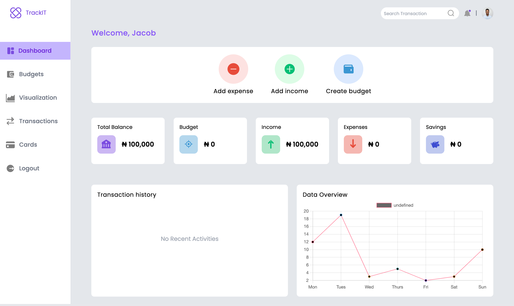

TrackIT - Web Based Accountability Management System

# TrackIT - Web Based Accountability Management System
Github: https://github.com/blessedmadukoma/trackit

Live: https://trackit-budget.vercel.app

Backend API: https://trackit-budget.vercel.app

## Project Description
This is the a web-based budget tracker to track finances. The site allows authorized users to manage their finances by creating budgets, adding the transactions and visualizing each income and expense.

 

## Project Tools
   - PostgreSQL ElephantDB
   - VScode

 

## Programming Languagues/framework/DBMS
 - HTML
 - TailwindCSS
 - JavaScript
 - Go(Golang)

 

## Deployed
 The project is deployed on [Vercel](https://trackit-budget.vercel.app) server.

 

## Screenshots
 

## APIs Needed
    - Backend API

 

## External Resources needed
    - PostgreSQL database connection

 

# Contributors
    - Blessed Madukoma (Developer)
    - Ajike Chimaobi (Designer)

## Important note:
   1. To push the backend directory to Heroku:
        - After adding, commiting and pushing to Github, run the command: `git subtree push --prefix backend heroku main`